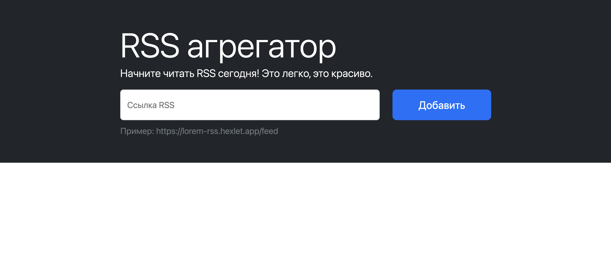
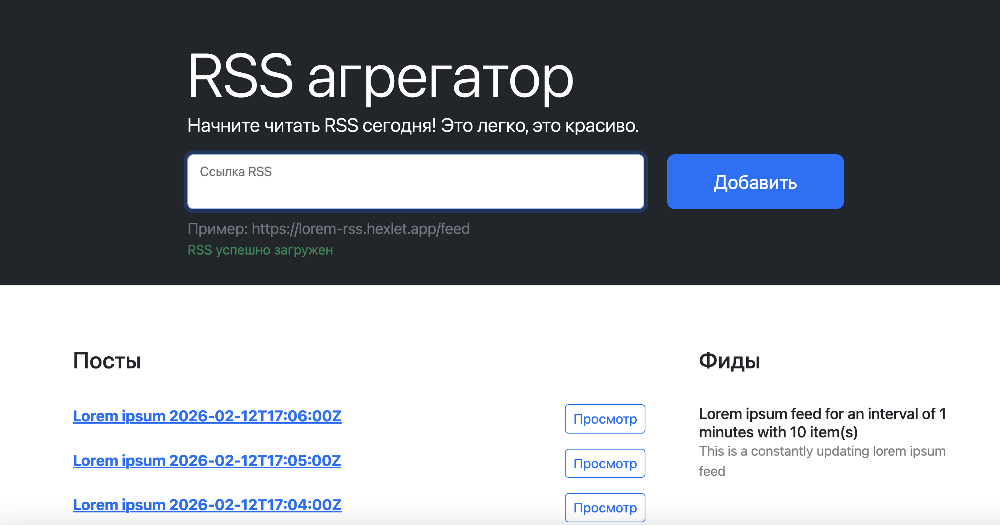
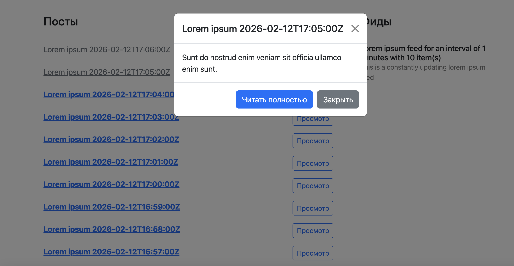

### Hexlet and Github Actions:
[](https://github.com/SergeevaEA/frontend-project-11/actions/workflows/build.yml)
[](https://github.com/SergeevaEA/frontend-project-11/actions/workflows/hexlet-check.yml)

### Качество кода:
[](https://sonarcloud.io/summary/new_code?id=SergeevaEA_frontend-project-11)

# RSS-агрегатор

Сервис для агрегации RSS-потоков на чистом JS с применением шаблона проектирования MVC.

## Технологический стек

JavaScript, DOM API, axios, Vite, Webpack, ESLint, Bootstrap, yup, on-change, lodash, i18next, Vercel

## Выполненные задачи

* создала страницу с формой для добавления RSS-потока
* реализовала валидацию введенного адреса с помощью yup
* реализовала вывод всех текстов интерфейса через библиотеку i18next
* реализовала скачивание потока, парсинг данных потока и добавление нужных данных в соответствующие списки, обработку ошибок
* реализовала код, который раз в 5 секунд проверяет каждый RSS-поток, и если он содержит новые посты, добавляет их в список
* реализовала возможность предпросмотра каждого поста по клику на кнопку рядом с названием поста (в модальном окне появляются заголовок и описание поста)

## Демонстрация работы проекта

```bash
https://frontend-project-11-5ll9.vercel.app/
```

Страница c формой для добавления RSS-потока:



Отображение данных потока:



Предпросмотр поста по клику на кнопку рядом с названием поста:



## Установка

Клонировать репозиторий:

```bash
git clone https://github.com/SergeevaEA/frontend-project-11.git
cd frontend-project-11
```

Установить зависимости:

```bash
make install
```

Запустить dev-сервер:

```bash
make dev
```
